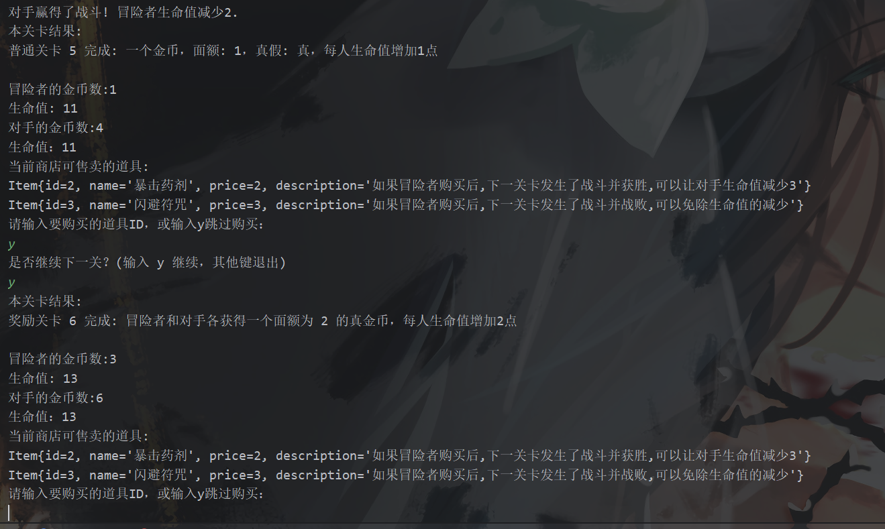
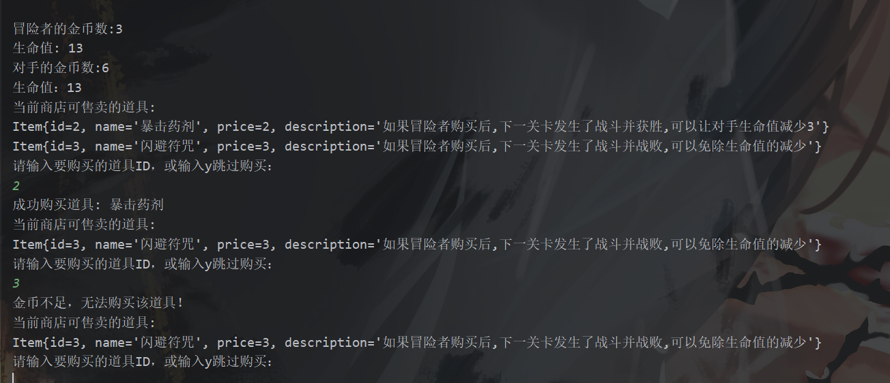

# lab8实验报告
## 实验内容
本次实验在lab7的基础上，实现对于中世纪大冒险小游戏的功能补全与扩展。
新增的功能有
- 对于金币系统进行更新，实现了假币和面额
- 对于兽人，矮人以及精灵各自独特的战斗设置
- 奖励关卡和普通关卡设置
- 商店系统的设立
- 冒险家受伤状态的设定
## 文件结构
Main.java

Creature.java
        -----Hobbit.java
        -----Monster.java
Game.java


Level.java
        -----NormalLevel.java
        -----RewardLevel.java


Shop.java
Item.java
Coin.java
## 整体架构
- Main
- Game 负责游戏的主体架构
- Level 父类
   - NormalLevel：子类1，正常关卡
   - RewardLevel：子类2，奖励关卡
- Creature 父类
    - Hobbit：子类1，霍比特人
    - Monster：子类2-4，三类敌对怪物
- Coin：金币类，实现假币以及面额功能
- Shop：商店类实现购买道具的功能
## 主要新增代码功能分析
1. Level类

成员变量
- `levelNumber`：关卡编号。
- `coin`：关卡中的金币对象。

构造方法
```java
public Level(int levelNumber) {
    this.levelNumber = levelNumber;
    this.coin = generateCoin();
}
```
- 初始化关卡编号和生成一个金币。
方法
- `getLevelNumber()`：返回关卡编号。
- `getCoin()`：返回金币对象。
- `generateCoin()`：生成一个金币对象，70%概率为真，面值固定为1。
- `play(Creature adventurer, Creature opponent)`：抽象方法，由子类实现关卡逻辑。


2. NormalLevel类

`NormalLevel` 类扩展了 `Level` 类，并实现了具体的游戏关卡逻辑。

 构造方法
```java
public NormalLevel(int levelNumber) {
    super(levelNumber);
}
```
- 调用父类 `Level` 的构造方法来初始化关卡编号。

`play` 方法
```java
@Override
public int play(Creature adventurer, Creature opponent) {
    ...
}
```
- 实现了抽象类 `Level` 的 `play` 方法，包含关卡中的具体逻辑。

主要逻辑
- **获取金币和实例化 `Hobbit` 对象**
   ```java
   Coin coin = getCoin();
   Hobbit hobbit = new Hobbit();
   if(adventurer instanceof Hobbit)
       hobbit = (Hobbit) adventurer;
   ```
   - 获取当前关卡中的金币。
   - 实例化一个 `Hobbit` 对象，如果冒险者是 `Hobbit` 类型，则进行类型转换。

- **判断对手是否战斗**
   ```java
   boolean opponentFights = opponent.isForMoney(adventurer);
   ```
   - 根据对手的行为决定是否战斗。

- **战斗逻辑**
   ```java
   if (opponentFights && adventurer.getLife() >= 2) {
       double winProbability = opponent.getWinProbability(adventurer);
       boolean opponentWins = new Random().nextDouble() < winProbability;
       ...
   }
   ```
   - 如果对手决定战斗且冒险者生命值不低于2，计算战斗结果。
   - 根据胜负调整生命值和金币数。

- **冒险者生命值不足的处理**
   ```java
   else if(adventurer.getLife() < 2) {
       ...
   }
   ```
   - 如果冒险者生命值低于2，处理不同情况下的金币分配。

- **关卡结束后的生命值调整**
   ```java
   if(adventurer.getLife() > 2)
       adventurer.setLife(adventurer.getLife() + 1);
   else {
       ...
   }
   opponent.setLife(opponent.getLife() + 1);
   hobbit.Baoji = false;
   hobbit.Shanbi = false;
   ```
   - 根据冒险者的生命值调整其生命值并处理可能的游戏结束情况。
   - 重置 `Hobbit` 的 `Baoji` 和 `Shanbi` 状态。

- **打印关卡结果**
   ```java
   System.out.println("本关卡结果:");
   System.out.println("普通关卡 " + getLevelNumber() + " 完成: 一个金币，面额: " + coin.getDenomination() + "，真假: " + (coin.isReal() ? "真" : "假") + "，每人生命值增加1点");
   ...
   ```
   - 输出关卡结果，包括金币信息和当前生命值。


3. RewardLevel类


 `Level` 类的子类，用于表示游戏中的奖励关卡

构造方法
```java
public RewardLevel(int levelNumber) {
    super(levelNumber);
}
```
- 调用父类 `Level` 的构造方法来初始化关卡编号。

`play` 方法
```java
@Override
public int play(Creature adventurer, Creature opponent) {
    ...
}
```
- 实现了抽象类 `Level` 的 `play` 方法，包含奖励关卡中的具体逻辑。

主要逻辑
- **创建金币对象**
   ```java
   Coin coin1 = new Coin(2, true);
   Coin coin2 = new Coin(2, true);
   ```
   - 创建两个面额为2的真金币对象。

- **分配金币和增加生命值**
   ```java
   adventurer.addCoin(coin1);
   opponent.addCoin(coin2);
   adventurer.setLife(adventurer.getLife() + 2);
   opponent.setLife(opponent.getLife() + 2);
   ```
   - 给冒险者和对手分别添加金币。
   - 增加冒险者和对手的生命值。

- **处理特殊情况**
   ```java
   if(adventurer instanceof Hobbit hobbit)
   {
       hobbit.Baoji=false;
       hobbit.Shanbi=false;
   }
   ```
   - 如果冒险者是 `Hobbit` 类型，重置其特殊状态。

- **打印关卡结果**
   ```java
   System.out.println("本关卡结果:");
   System.out.println("奖励关卡 " + getLevelNumber() + " 完成: 冒险者和对手各获得一个面额为 2 的真金币，每人生命值增加2点");
   ...
   ```
   - 输出关卡结果，包括金币信息和当前生命值。

4. Coin类

`Coin` 类用于表示游戏中的金币，包含了金币的面额和真实性。
 成员变量
- `denomination`：金币的面额。
- `isReal`：表示金币是否为真实金币。

构造方法
```java
public Coin(int denomination, boolean isReal) {
    this.denomination = denomination;
    this.isReal = isReal;
}
```
- 构造方法接受金币的面额和是否为真实金币，并进行初始化。

方法
- **getDenomination**
   ```java
   public int getDenomination() {
       return denomination;
   }
   ```
   - 返回金币的面额。

- **isReal**
   ```java
   public boolean isReal() {
       return isReal;
   }
   ```
   - 返回金币是否为真实金币。

- **getValue**
   ```java
   public int getValue() {
       return isReal ? denomination : 0;
   }
   ```
   - 返回金币的价值，如果是真实金币则返回面额，否则返回0。

- **setDenomination**
   ```java
   public void setDenomination(int denomination) {
       this.denomination = denomination;
   }
   ```
   - 设置金币的面额。

- **setReal**
   ```java
   public void setReal(boolean isReal) {
       this.isReal = isReal;
   }
   ```
   - 设置金币是否为真实金币。

- **toString**
   ```java
   @Override
   public String toString() {
       return "Coin{" +
               "denomination=" + denomination +
               ", isReal=" + isReal +
               ", value=" + getValue() +
               '}';
   }
   ```
   - 返回金币对象的字符串表示，包括面额、是否为真实金币以及价值。


5. Shop类

这段代码定义了一个名为 `Shop` 的类，用于表示游戏中的商店。商店中有各种道具，冒险者可以购买这些道具来增强自己的能力。
提供了道具展示和购买功能，包含了检查金币数量和扣除金币的逻辑。
 成员变量
- `items`：存储商店中可售卖的道具列表。
- `soldItems`：存储已经售出的道具列表。

构造方法
```java
public Shop() {
    items = new ArrayList<>();
    soldItems = new ArrayList<>();
    // 添加道具
    items.add(new Item(1, "生命药剂", 2, "恢复冒险者2点生命值"));
    items.add(new Item(2, "暴击药剂", 2, "如果冒险者购买后,下一关卡发生了战斗并获胜,可以让对手生命值减少3"));
    items.add(new Item(3, "闪避符咒", 3, "如果冒险者购买后,下一关卡发生了战斗并战败,可以免除生命值的减少"));
}
```
- 初始化 `items` 和 `soldItems` 列表，并添加一些初始道具。


- **displayItems**
   ```java
   public void displayItems() {
       System.out.println("当前商店可售卖的道具:");
       int flag = 0;
       for (Item item : items) {
           flag = 1;
           System.out.println(item);
       }
       if (flag == 0)
           System.out.println("当前商店道具已卖光");
   }
   ```
   - 显示商店中当前可售卖的道具。如果没有可售卖的道具，提示道具已卖光。

- **purchaseItem**
   ```java
   public boolean purchaseItem(int id, Creature hobbit) {
       for (Item item : items) {
           if (item.getId() == id) {
               if (canAfford(item, hobbit.getCoins())) {
                   soldItems.add(item);
                   items.remove(item);
                   deductCoins(item.getPrice(), hobbit.getCoins());
                   if (hobbit instanceof Hobbit specificHobbit) {
                       if (item.getId() == 2)
                           specificHobbit.Baoji = true;
                       if (item.getId() == 3)
                           specificHobbit.Shanbi = true;
                       if (item.getId() == 1)
                           hobbit.setLife(hobbit.getLife() + 2);
                   }
                   System.out.println("成功购买道具: " + item.getName());
                   return true;
               } else {
                   System.out.println("金币不足，无法购买该道具！");
                   return false;
               }
           }
       }
       System.out.println("无效的道具ID！");
       return false;
   }
   ```
   - 根据道具ID购买道具，检查冒险者是否有足够的真金币，如果有则进行购买，并更新冒险者的状态。
   - 购买成功后，将道具从 `items` 列表中移除，并添加到 `soldItems` 列表中。

- **canAfford**
   ```java
   private boolean canAfford(Item item, List<Coin> coins) {
       int totalValue = 0;
       for (Coin coin : coins) {
           if (coin.isReal()) {
               totalValue += coin.getValue();
           }
       }
       return totalValue >= item.getPrice();
   }
   ```
   - 检查冒险者是否有足够的真金币购买指定的道具。

- **deductCoins**
   ```java
   private void deductCoins(int price, List<Coin> coins) {
       int remainingPrice = price;
       for (Coin coin : coins) {
           if (coin.isReal()) {
               if (coin.getValue() <= remainingPrice) {
                   remainingPrice -= coin.getValue();
                   coin.setReal(false); // 将真金币设为假币，表示已使用
               } else {
                   // 找零
                   int change = coin.getValue() - remainingPrice;
                   coin.setDenomination(change); // 修改面额为找零后的值
                   remainingPrice = 0;
               }
           }
           if (remainingPrice == 0) {
               break;
           }
       }
   }
   ```
   - 扣除冒险者的真金币来支付道具价格。更新金币的状态，如果需要找零则更新金币的面额。

## 实际演示

输入目的地名称后回车，直接开始第一关的冒险，首先会打印出来对手是什么生物，生物后的@****在此我想直接当做生物的编号（当然如果不想要去掉也是简单的），然后输出本次战斗的情况，在这里是对手胜利，我方减少2点生命值。接下来输出关卡序号和金币的情况，以及打印出来本关卡通过后对手和hobbit自身血量加1的情况。

接下来输入y表示跳过购买，在输入y表示进入下一关，如果在此时输入其他，那么将认为退出闯关，hobbit人失败

以上这张图片展示了购买生命药水的效果，购买后生命值加2，同时商店中的生命药水已经卖光，在下一个售卖时就不展示生命药水选项。

以上展示了通过奖励关卡的效果，两方不起争斗，各获得价值为2的真货币，同时生命值加一。

金币不足，提示购买失败

购买暴击药水后的效果，如果在下一回合胜利则减少对方3点生命值

抵达终点，显示目的地名称，并计算冒险者评分。注意此时评分计算是用冒险者最终的金币除以游戏中分发出去的总真金币。
## 实验收获
在本次实验中对上次lab实现的功能进行了丰富与完善。对上次lab大规模的重构，更加深刻的理解了我们在开发代码时十分必要保证软件的质量和可扩展性，在代码中合理使用继承，抽象类，重载，重写，多态等面向对象的知识可以是我们的代码更易懂，更具可扩展性。

