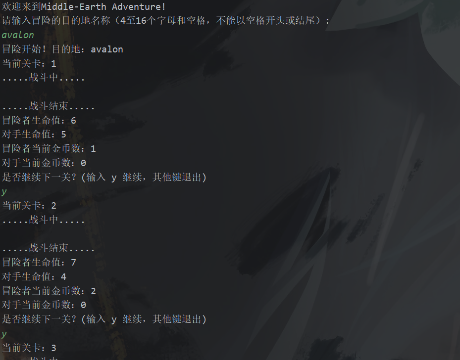
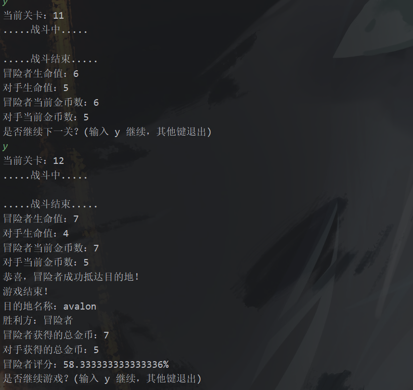

# lab7实验报告
22307130158 吴优
## 实验内容
实现中世纪冒险小游戏，要求遵循面向对象编程原则
## 架构分析
### Creature类
1. **属性**：
   - `life`：表示生物的生命值。
   - `money`：表示生物持有的金币数。

2. **构造函数**：
   - 用于初始化生命值和金币数。

3. **方法**：
   - `isDead()`：判断生物是否已经死亡，当生命值为0时返回 `true`。
   - `isForMoney()`：抽象方法，用于判断生物是否为了金币而战斗。由具体子类实现。
   - `setLife(int newLife)`：设置生物的生命值。
   - `getLife()`：获取生物的生命值。
   - `setMoney(int money)`：设置生物的金币数。
   - `getMoney()`：获取生物的金币数。

提供了一种通用的生物模型，其他具体的生物类（如 `Hobbit`、`Dwarf`、`Elf`、`Orc` 等）可以继承该抽象类，并根据自身特点重写各函数，使得代码更加模块化和易于扩展。
```java
public abstract class Creature {
    private int life;
    private int money;

    public Creature(int initialLife, int initialMoney) {
        this.life = initialLife;
        this.money = initialMoney;
    }
    public Boolean isDead()
    {
        return life==0;
    }
    public abstract boolean isForMoney();


    public  void setLife(int newLife)
    {
        this.life=newLife;
    }

    public int getLife() {
        return life;
    }

    public void setMoney(int money) {
        this.money = money;
    }

    public int getMoney() {
        return money;
    }
}
```


### Hobbit类

这里提供的 `Hobbit` 类是 `Creature` 抽象类的一个具体子类，用于表示霍比特人（Hobbit）角色。

1. **继承关系**：
   - `Hobbit` 类继承自 `Creature` 抽象类，因此需要实现父类中的抽象方法 `isForMoney()`。

2. **构造方法**：
   - `Hobbit()` 构造方法调用了父类 `Creature` 的构造方法，使用 `generateRandomLife()` 方法生成随机的生命值，并将金币数设置为 0。

3. **方法重写**：
   - `isForMoney()` 方法重写了父类中的抽象方法，根据霍比特人的生命值判断是否为了金币而战斗。

4. **静态方法**：
   - `generateRandomLife()` 是一个静态方法，用于生成一个随机的生命值，范围为 5 到 9（包含5和9）。

```java
import java.util.Random;

public class Hobbit extends Creature {
    public Hobbit() {
        super(generateRandomLife(), 0);
    }
    public boolean isForMoney()
    {
        return getLife()>=2;
    }

    @Override
    public void setLife(int newLife) {
        super.setLife(newLife);
    }

    private static int generateRandomLife() {
        return new Random().nextInt(5) + 5; // 5-9的随机生命值
    }
}
```

### Monster类
实现了矮人、精灵、兽人对象的定义，继承自creature类，目前无特别设置的方法，为后续lab的扩展性做准备。篇幅限制在此不展示。


### Adventure类
这个 `Game` 类是一个用于控制中世纪大冒险游戏的类，主要负责游戏的开始、进行和结束过程。

1. **属性**：
   - `destination`：目的地名称。
   - `hobbit`：冒险者（霍比特人）对象。
   - `monster`：对手（矮人、精灵、兽人）对象。
   - `checkpoint`：当前关卡数。
   - `finalCheckpoint`：最终关卡数，游戏的结束条件之一。

2. **构造方法**：
   - `Game(String destination, Creature hobbit, Creature monster)`：构造函数，初始化目的地名称、冒险者和对手。

3. **方法**：
   - `start()`：开始游戏的方法，控制游戏的进行过程，包括模拟战斗、关卡切换、生命值变化等。
   - `simulateBattle()`：模拟战斗的方法，根据冒险者和对手的生命值比例，计算战斗结果。
   - `displayResult()`：显示游戏结果的方法，在游戏结束后调用，显示目的地名称、胜利方、冒险者和对手获得的总金币数以及冒险者评分。

实现了游戏的主要逻辑，并将游戏过程中的信息进行了输出和展示

```java
import java.util.Scanner;

public class Game {
    private final String destination;
    private final Creature hobbit;
    private final Creature monster;
    private int checkpoint;
    private final int finalCheckpoint = 12;

    public Game(String destination, Creature hobbit, Creature monster) {
        this.destination = destination;
        this.hobbit = hobbit;
        this.monster = monster;
        this.checkpoint = 1;
    }

    public void start() {
        System.out.println("冒险开始！目的地：" + destination);

        Scanner scanner = new Scanner(System.in);
        while (checkpoint <= finalCheckpoint && hobbit.getLife() > 0) {
            System.out.println("当前关卡：" + checkpoint);


            if(!monster.isDead()) {
                // 模拟战斗
                if (!hobbit.isForMoney()) {
                    System.out.println("冒险者生命值过低，无法继续战斗！");
                    monster.setMoney(monster.getMoney() + 1);
                } else {
                    boolean hobbitWin = simulateBattle();

                    if (hobbitWin) {
                        hobbit.setMoney(hobbit.getMoney() + 1);
                        monster.setLife(monster.getLife() - 2);
                    } else {
                        monster.setMoney(monster.getMoney() + 1);
                        hobbit.setLife(hobbit.getLife() - 2);
                    }
                    System.out.println(".....战斗结束.....");
                }
            }
            else {
                hobbit.setMoney(hobbit.getMoney()+1);
            }
            System.out.println("冒险者生命值：" + hobbit.getLife());
            System.out.println("对手生命值：" + monster.getLife());
            System.out.println("冒险者当前金币数：" + hobbit.getMoney());
            System.out.println("对手当前金币数：" + monster.getMoney());

            if (hobbit.getLife() <= 0) {
                System.out.println("冒险者生命值已降为0，游戏结束！");
                break;
            }

            if (checkpoint == finalCheckpoint) {
                System.out.println("恭喜，冒险者成功抵达目的地！");
                break;
            }

            System.out.println("是否继续下一关？(输入 y 继续，其他键退出)");
            String choice = scanner.nextLine();
            if (!choice.equalsIgnoreCase("y")) {
                System.out.println("游戏提前结束，直接结算（若冒险者未到达目的地则判负）");
                break;
            }

            checkpoint++;
            hobbit.setLife(hobbit.getLife() + 1); // 冒险者生命值增加
            if(!monster.isDead())
                monster.setLife(monster.getLife() + 1); // 对手生命值增加
        }
    }

    private boolean simulateBattle() {
        System.out.println(".....战斗中.....");
        System.out.println();
        double hobbitLifeRatio = hobbit.getLife() / 10.0;
        double monsterLifeRatio = monster.getLife() / 10.0;
        double hobbitWinProbability = 0.5;

        if (hobbitLifeRatio > monsterLifeRatio) {
            hobbitWinProbability = 0.7;
        }

        return Math.random() < hobbitWinProbability;
    }
    public void displayResult() {
        System.out.println("游戏结束！");

        // 显示目的地名称
        System.out.println("目的地名称：" + destination);

        // 判断胜利方
        String winner = (hobbit.getLife() > 0&&checkpoint==finalCheckpoint) ? "冒险者" : "对手";
        System.out.println("胜利方：" + winner);

        // 计算冒险者和对手获得的总金币
        int totalHobbitMoney = hobbit.getMoney();
        int totalMonsterMoney = monster.getMoney();
        int totalMoney = totalHobbitMoney + totalMonsterMoney;
        System.out.println("冒险者获得的总金币：" + totalHobbitMoney);
        System.out.println("对手获得的总金币：" + totalMonsterMoney);

        // 显示冒险者评分
        double hobbitScore = (double) totalHobbitMoney / totalMoney * 100;
        System.out.println("冒险者评分：" + hobbitScore + "%");
    }

}
```
## 主要功能及解析
1. 开始信息及读入目的地
```java
public static void main(String[] args) {
        System.out.println("欢迎来到Middle-Earth Game!");

        Scanner scanner = new Scanner(System.in);

        while (true) {
            System.out.println("请输入冒险的目的地名称（4至16个字母和空格，不能以空格开头或结尾）:");
            String destination = scanner.nextLine().trim();

            if (isValidDestination(destination)) {
                startAdventure(destination);
            } else {
                System.out.println("目的地名称格式不正确，请重新输入。");
            }

            System.out.println("是否继续游戏？(输入 y 继续，其他键退出)");
            String choice = scanner.nextLine();
            if (!choice.equalsIgnoreCase("y")) {
                break;
            }
        }

        System.out.println("游戏结束，谢谢参与！");
    }
    private static boolean isValidDestination(String destination) {
        return destination.matches("^[a-zA-Z]+(?:\\s+[a-zA-Z]+)*$") && destination.length() >= 4 && destination.length() <= 16;
    }
```
使用循环直到输入正确后才进入到游戏中，否则需要重新输入或者直接退出游戏。
判断输入是否正确采用正则表达式来保证名称中前后不含空格，并从字符串长度判断输入目的地的长度是否在4~16.

2. 模拟战斗
   模拟战斗相关代码在Adventure类中的start()与simulateBattle()方法中，由于篇幅限制此处不再次展示。主要逻辑如下：
    首先，通过检查对手是否已经死亡，确定是否需要进行战斗。如果对手已经死亡，则不再进行战斗，直接让冒险者获得金币。如果对手尚未死亡，则根据冒险者的生命值来判断是否可以继续战斗。如果冒险者的生命值过低（小于2），则无法继续战斗，将直接让对手获得金币。否则，根据战斗胜负进行结算：如果冒险者获胜，则获得一枚金币，并使对手的生命值减少2；如果对手获胜，则获得一枚金币，并使冒险者的生命值减少2。战斗结束后，会输出战斗结束的提示信息。其中，战斗的胜负通过 simulateBattle() 方法模拟，根据冒险者和对手的生命值比例，计算冒险者获胜的概率。

3. 最终结算
   最终结算相关代码在Adventure类中的displayResult()方法中，不再次展示。
   这段代码负责显示游戏结果。首先，输出游戏结束的提示信息。然后，显示目的地名称。接着，根据冒险者和对手的生命值以及当前关卡数，判断游戏的胜利方。如果冒险者的生命值大于0并且已经到达了最终关卡，则胜利方是冒险者，否则胜利方是对手。然后，计算冒险者和对手获得的总金币数，分别获取冒险者和对手当前持有的金币数，并相加得到总金币数。最后，根据冒险者获得的总金币数与总金币数的比例，计算冒险者的评分。评分计算公式为：冒险者获得的总金币数除以总金币数乘以100%。最终，输出胜利方、冒险者和对手获得的总金币数以及冒险者的评分。
    冒险者胜利的条件是不死亡且到达最终关卡，如果在冒险到某一关时，在控制台选择退出，此时因为没有到达终点，默认判断冒险者失败。
## 实际演示
由于输出太多且繁琐，在此展示一次实验的开始和结束的部分界面

